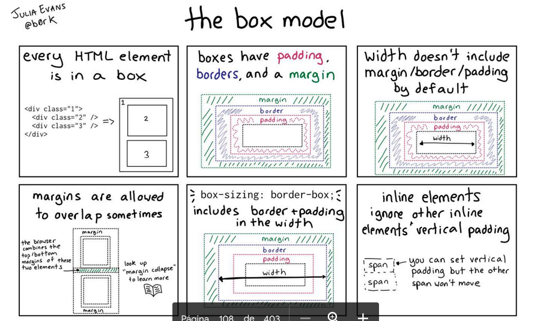

# CSS

Aqui estaran los ejercicios de css

## Explicaciones 

## Selectores
- [Ejercicio 1](Ejercicio01)
- [Ejercicio 2](Ejercicio02)
- [Ejercicio 3](Ejercicio03)
- [Ejercicio 4](Ejercicio04)
- [Ejercicio 5](Ejercicio05)

## Atributos
- [Ejercicio 6: Column](Ejercicio06)
- [Ejercicio 7: Box model](Ejercicio07)
- [Ejercicio 8: Text and box alignment](Ejercicio08)
- [Ejercicio 9: Border radius circular](Ejercicio09)
- [Ejercicio 10: Overflow](Ejercicio10)
- [Ejercicio 11: Outline](Ejercicio11)
- [Ejercicio 12: Position](Ejercicio12)
- [Ejercicio 13: Diana](Ejercicio13)
- [Ejercicio 14: Float](Ejercicio14)
- [Ejercicio 15: Float and Clear](Ejercicio15)