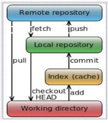
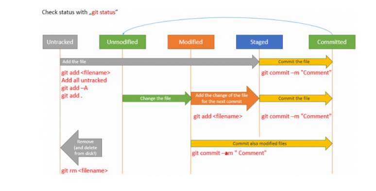

# COMMANDOS GIT
En git hay diferentes comandos, los mas basicos son:

## Comandos creativos
### git add
Con `git add` añadimos un archivo a el stage, para poder tenerlo controlado y poder commitearlo

### git commit
Con `git commit` empaquetamos los cambios en el stage en un commit, asi luego podiendo transmitir estos cambios.

### git push
Con `git push` transmitimos nuestros datos de nuestro repositiorio, normalmente para transmitir nuestros commits.

## Comandos Receptivos
### git pull
Con `git pull` podemos traer los cambios remotos a nuestro repositorio local, mergeandolos directamente en caso de no haber problemas

### git fetch
Con `git fetch` podemos recivir los cambios remotos sin hacer merge directamente, muchas veces podemos usar este comando simplemente para saber si nuestros colavoradores hicieron un commit, lo pushearon y esta esperando a ser pulleado. 

### git clone
Con `git clone` copiamos un repositorio remoto para adquirir nuestro propio repositorio local.

## Comandos Destructivos
### git rm
Con `git rm` eliminamos un archivo tanto de el stage como de disco, si queremos quitarlo solo del stage usamos:

```sh
git rm --cached
```  

## Resumen en imagenes:


